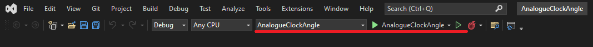
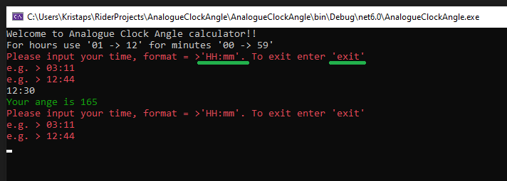
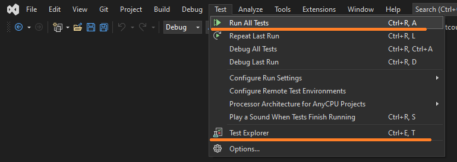

# AnalogueClockAngleCalculator

An ASP.NET Core Console .NET 6 application which caluclates the <b>lesser</b> angle in degrees between hours arrow and minutes arrow and provide output in the console window.

### To run your program:

If you are new to .NET visit [microsoft.com](https://dotnet.microsoft.com/en-us/learn)

1. You need to clone or download project from GitHub [project page](https://github.com/kristaps-m/AnalogueClockAngleCalculator)
2. You need the .NET Framework and an IDE (integrated development environment) to work with the C# language. [Try this page to get started.](https://www.simplilearn.com/c-sharp-programming-for-beginners-article)
3. Open and run project with capable IDE of your choice. I used Visual Studio in example below.

4. Popup window will show up. You need to enter clock time in correct format. Like in example below ('HH:mm'). If you are done calculation angles enter 'exit'.

5. If you want to run tests, go back to your Visual Studio. In picture below you can see how to run them.

